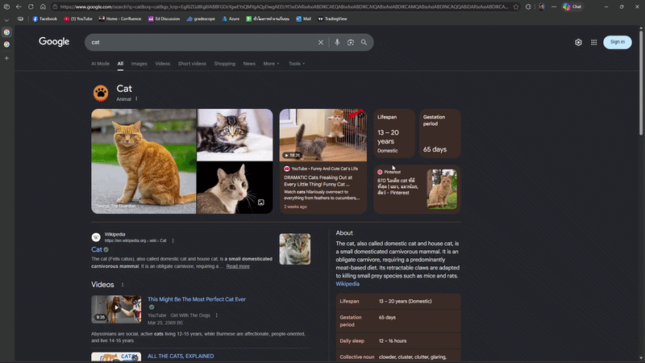

# Crop2Search

Crop2Search is a local-first browser extension for Chrome and Firefox that lets you crop part of any webpage and send it to Google Lens in a new tab.



## Why Use It

- Search a product, illustration, meme, or screenshot fragment without saving an image first
- Choose between rectangle selection and freeform selection
- Start from the toolbar button or the `start-selection` browser command
- Keep capture and cropping inside the browser before opening Google Lens

## Install In 3 Minutes

### 1. Install dependencies

```bash
npm install
```

### 2. Build the extension

```bash
npm run build
```

Build output:

- `dist/chrome`
- `dist/firefox`

### 3. Load it in your browser

**Chrome**

1. Open `chrome://extensions/`
2. Enable **Developer mode**
3. Click **Load unpacked**
4. Select `dist/chrome`

**Firefox**

1. Open `about:debugging#/runtime/this-firefox`
2. Click **Load Temporary Add-on**
3. Open any file inside `dist/firefox`

## How To Use It

1. Start Crop2Search from the toolbar button or the browser command shortcut.
2. Select the part of the page you want to search.
3. Review the Google Lens results in the new tab that opens automatically.

### Selection Modes

- `Rectangle`: click and drag for a fast rectangular crop
- `Freeform`: click around the subject and double-click to finish

### Shortcut And Controls

- Default command: `Ctrl+Shift+Y`
- Press `Esc` to cancel an active selection
- Change the default selection mode from the extension options page

## What It Does Well

- Works across arbitrary webpages
- Supports both precise box crops and irregular outlines
- Keeps the extension flow lightweight and quick to trigger

## Development

### Commands

- `npm run build` builds the Chrome and Firefox bundles
- `npm run typecheck` runs TypeScript checks
- `npm test` runs the test suite
- `npm test:watch` runs tests in watch mode

### Project Layout

- `src/background/` coordinates activation and search flow
- `src/content/` handles page-level selection sessions
- `src/overlay/` renders the in-page selection UI
- `src/capture/` crops the captured image
- `src/search/` prepares and submits the Google Lens search
- `src/options/` stores user preferences like default selection mode
- `src/shared/` contains shared types, storage, and utilities
- `manifests/` contains browser-specific extension manifests

### Browser Support

- Chrome 90+
- Firefox 88+

## Contributing

Contributions are welcome. Keep changes aligned with the current TypeScript structure, include tests when behavior changes, and make sure type checks and tests pass before submitting.

## License

See `LICENSE` for details.
